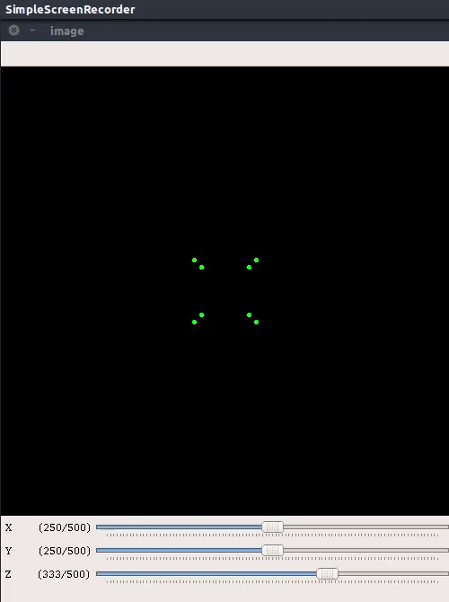
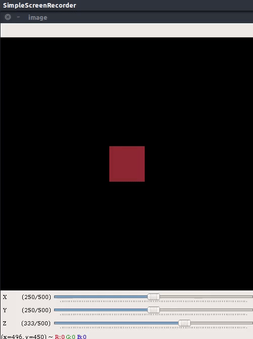
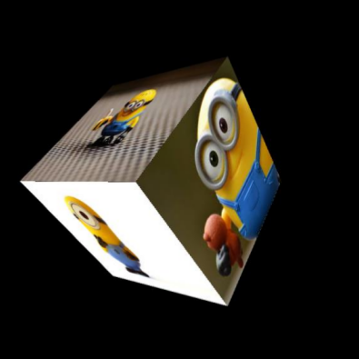
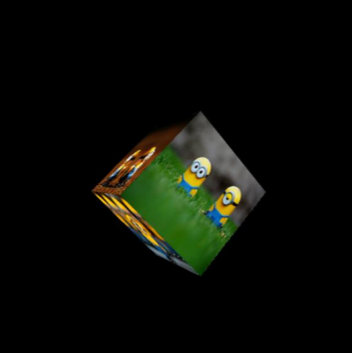

## Project in brief
PixoCube is a digital version of photo cubes that people usually gift others. It is basically a 3D cube with different images consisting of different sides of the cube. The interesting part of this project is I used concepts of **camera projection** and only opencv functions to render the cube. Moreover the camera view point is rendered such that it shifts based on the movement of users face. The rendering code was written using **OpenCV in C++ witout OpenGL**. 

[**Link to the video**](https://www.youtube.com/watch?v=-MyrN2wd8I4)

## Key points of the project

* Understanding all the components of a **camera projection matrix**.
* Developing a virtual camera using a **self defined camera projection matrix**.
* Calculating pixel coordinates of vertices of a 3D cube when projected into the virtual camera.
* Using the projected pixel coordinates and **perspective transform**, rendering sides of the cube with different images.
* Using **dlib** based face detection method and controling camera position coordinates as the user moves her/his face, giving the 3D effect.
* Created a **python wrapper** for the C++ based code.

## Creating a 3D cube
A cube is initialised with centre at origin and side = 1meter. I created two major classes
one for handling and defining the 3D cube and one for the virtual camera. The cube is
initialised when the object for 3D cube is created. The cube is defined here by its 8 vertices.

## Creating the virtual camera
To define a virtual camera we define a set of matrices which represent different properties
of a camera. We use the following matrices to represent different properties of the virtual
camera :

* Translation matrix (T) : To represent the translation of camera in real world.
* Rotation matrix (R) : To represent the rotations of camera about x, y and z axis.
* Camera matrix (K) : To represent the properties of virtual camera like, focal length (f),
apparent pixel size (sx), apparent centre of the image in pixel coordinates.
Using the above matrices we define the camera projection matrix (P).

## Deriving projection of 3D cube vertices in the virtual camera
The camera projection matrix (P) mentioned in the above section is used to find the
projection of the 3D cube vertices in the camera frame. Which means given the position
and orientation of the camera and cube we can find the image coordinates for each vertex
of the 3D cube. Thus driving the projection is simply a matrix operation that finds the 2d
pixel coordinates in the image frame for given 3D coordinates of each vertex of the cube.
These projected pixel coordinates of the cube vertices are used to render the cube.

I was unable to get the rotation effect of the camera due to incorrect implimentation but I was able to solve the bug after getting a better understanding of the fundamental concepts behind image formation and camera projection matrix after attending CS763: Computer Vision Spring 2020 course at IIT Bombay.

  

  

### Rendering of the 3D cube
We use the image pixel coordinates derived in step 2.3. to render the final cube. The
process of rendering the cube consists of the following steps:
* Storing the projected 2d coordinates of vertices for each face of the cube is a list.
* Finding the distance of centre of each face from the camera.
* Selecting and importing images for each face of the cube.
* Rendering faces of the cube by applying perspective warping using image dimensions
as source points and the derived 2D coordinates of corners of the cube faces as
destination points. The order of rendering is such that the face farthest from the camera
is rendered first.

The last step in the process of rendering is performed to ensure that opaque nature of the
object. There are many advanced algorithms in graphics processing literature that perform
this task in a better way but for our case distance based sorting works.

  

  

### Face tracking for controlling the camera view point
Camera view point is changed using face tracking to generate an effect where the rendered
cube would feel like a real cube as it will change the perspective with respect to the
position of the user.
Process of updating the camera view point using face tracking consists of the following
steps :

* Detecting the face of user. I am doing this using the face
detection method available in dlib. This method returns list of coordinates of
bounding boxes for each face detected by the algorithm.
* Since the application can only support single user we index the bounding box
coordinates related to the first face detected.
* We use the bounding box values to further calculate the centre of the bounding box.
* We use the coordinates of the centre to map the movement of user and the virtual
camera to generate the 3D perspective effect.
* The width of the bounding box is used to control the z coordinates of the virtual
camera.
* **Kalman Filter** is used to track the face. Realtime performance of the software is improved
by using Kalman Filter to predict the bounding box position and width and face detection is used for only 
20 percent of the frames to improve/update the estimates.
Some results of face detection and tracking are show below.

  

## Instructions to setup and run the project demo

1. When running demo.py for the first time, use the following command `bash script.sh`.
2. When not running it for the first time use the following command `python3 demo.py`

